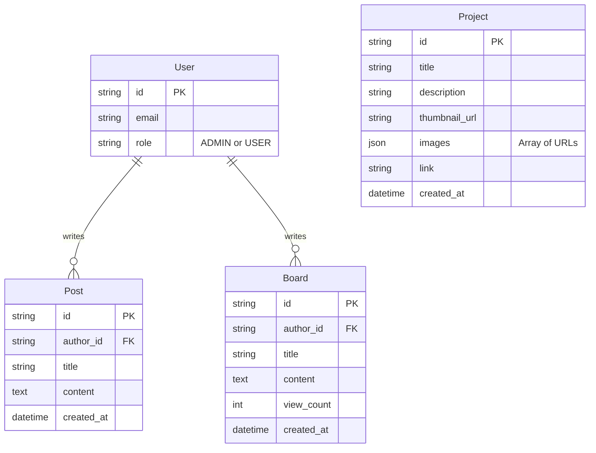

# 📊 Ben Lee 포트폴리오 웹사이트 분석 보고서

본 보고서는 현재 구축된 Ben Lee(Back-end & ABAP Developer)의 포트폴리오 웹사이트에 대한 종합적인 분석, 기술 스택, 보완 내역 및 향후 백엔드/데이터베이스 확장 제안을 담고 있습니다.

---

## 1. 프로그램 정의 (Definition)

본 프로그램은 개발자 **Ben Lee**의 개인 포트폴리오 및 블로그 웹사이트입니다. 
방문자에게 개발자의 역량, 작업한 프로젝트, 기술적 생각(Writing), 연락처 등을 직관적이고 세련된 방식으로 전달하는 것을 목적으로 합니다.
최근 추가된 `Board` 기능을 통해 동적인 데이터 처리를 위한 기반을 마련하고 있습니다.

**주요 기능:**
- **Hero 섹션**: 방문자에게 강렬한 첫인상을 주는 동적 타이포그래피 및 소개
- **Projects / Writings**: 갤러리 형태의 모달 인터페이스를 통한 시각적 포트폴리오 및 글 제공
- **Contact**: 협업 제안을 위한 직관적인 이메일 연락처 제공
- **Board (게시판)**: 사용자 간 소통 또는 공지사항을 위한 게시판 기능

---

## 2. 기술 스택 (Tech Stack)

프론트엔드 중심의 현대적인 웹 생태계를 기반으로 구축되었습니다.

- **Framework**: `Next.js 14` (App Router 기반)
- **Library**: `React 18`
- **Language**: `TypeScript`
- **Styling**: `Tailwind CSS` (유틸리티 퍼스트 CSS)
- **Animation**: `Framer Motion` (부드러운 스크롤 및 모달 전환 애니메이션)
- **Optimization**: `next/image` (이미지 최적화), `next/font` (폰트 최적화)

---

## 3. 보완사항 (Improvements)

### 3.1. 최근 완료된 주요 개선 사항
최근 작업을 통해 프론트엔드의 주요 기술 부채와 성능 이슈를 해결했습니다.
1. **성능 최적화 (Server Components)**: 
   - 정적 섹션(`Projects`, `Writings`, `Contact`)을 서버 컴포넌트로 전환하여 클라이언트 자바스크립트 번들 사이즈를 최소화했습니다.
2. **접근성 (Accessibility / a11y)**: 
   - 키보드 네비게이션(Tab, 방향키, ESC) 지원, 모달 포커스 트래핑, 스크린 리더를 위한 ARIA 속성을 추가했습니다.
3. **이미지 최적화**: 
   - 기존 `` 태그를 `next/image`로 전환하여 WebP/AVIF 자동 변환 및 지연 로딩(Lazy Loading)을 적용했습니다.
4. **SEO (검색 엔진 최적화)**: 
   - Open Graph, Twitter Card, JSON-LD 구조화 데이터 등을 추가하여 소셜 공유 및 검색 엔진 노출도를 극대화했습니다.
5. **안정성 (Error Handling)**: 
   - 전역 및 게시판 전용 `error.tsx` 바운더리를 설정하여 에러 발생 시 우아한 실패(Graceful Degradation)를 구현했습니다.

### 3.2. 향후 보완 제안 (Next Steps)
- **다크 모드 지원**: `Tailwind CSS`의 다크 모드 기능을 활용한 테마 토글 기능
- **다국어 지원 (i18n)**: 글로벌 채용 및 협업을 위한 영문/국문 동시 지원
- **CI/CD 파이프라인**: GitHub Actions를 활용한 자동 빌드 및 린트 검사
- **테스트 코드 도입**: Jest 또는 Playwright를 이용한 핵심 UI 컴포넌트 테스트

---

## 4. 백엔드 및 데이터베이스 구축 제안

현재 하드코딩된 정적 데이터(`data/projects.ts`, `data/writings.ts`)와 임시 게시판 로직을 실제 데이터베이스와 백엔드 서버로 전환하기 위한 아키텍처 제안입니다.

### 4.1. 아키텍처 방향성
Next.js의 풀스택 기능을 최대한 활용하는 **Serverless Architecture**를 권장합니다. 별도의 백엔드 서버를 구성하는 것보다 운영 비용과 관리 포인트가 적습니다.

### 4.2. 추천 기술 스택
- **API 레이어**: Next.js Route Handlers (`app/api/...`) 또는 Server Actions
- **Database**: `PostgreSQL` (Vercel Postgres 또는 Supabase 권장)
- **ORM (Object-Relational Mapping)**: `Prisma` 또는 `Drizzle ORM` (TypeScript와의 완벽한 호환성)
- **인증 (Authentication)**: `NextAuth.js (Auth.js)` (관리자 로그인 및 게시판 작성자 인증)
- **스토리지 (Storage)**: `AWS S3` 또는 `Supabase Storage` (프로젝트 썸네일 및 게시판 첨부 이미지 저장)

### 4.3. 데이터베이스 스키마 설계 (예시)

### 4.4. 구축 단계 (Roadmap)

1. **Phase 1: DB 연결 및 ORM 설정**
   - Vercel Postgres 등 DB 프로비저닝
   - Prisma 스키마 작성 및 마이그레이션 (`Project`, `Post` 테이블)
2. **Phase 2: 관리자 인증 시스템 도입**
   - NextAuth.js를 활용하여 사이트 소유자(Ben Lee)만 접근 가능한 관리자 대시보드 라우트(`/admin`) 생성
3. **Phase 3: 데이터 마이그레이션 및 API 연동**
   - 기존 `.ts` 파일의 데이터를 DB로 마이그레이션
   - 클라이언트 컴포넌트에서 API 통신 또는 서버 컴포넌트에서 DB 직접 호출 적용
4. **Phase 4: 파일 업로드 파이프라인 구축**
   - 이미지 파일을 S3 스토리지에 업로드하고 해당 URL을 DB에 저장하는 로직 구현 (AWS SDK 또는 Supabase 연동)
