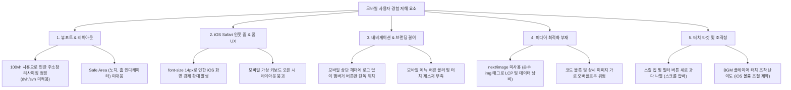

# 📱 Ben Lee 포트폴리오 사이트 모바일 최적화 작업서

본 작업서는 **Ben Lee 포트폴리오 웹사이트**를 스마트폰 및 태블릿 환경에 최적화하여, 데스크톱 중심의 레이아웃을 모바일 퍼스트(Mobile-First) 수준의 완성도와 앱 수준(App-like)의 매끄러운 UX로 전면 개선하기 위한 상세 실행 계획서입니다.

---

## 1. 사이트 현황 진단 및 핵심 취약점 분석 (Audit Report)

현재 사이트(Next.js 14, Tailwind CSS, Framer Motion)를 모바일 뷰포트(360px ~ 430px) 기준으로 전수 분석한 결과, 다음과 같은 주요 취약점이 발견되었습니다.

### 1.1. 주요 문제점 상세

| 구분 | 파일 위치 | 현재 상태 및 문제점 | 모바일 영향도 |
| :--- | :--- | :--- | :--- |
| **뷰포트/레이아웃** | [layout.tsx](file:///Users/benlee/Desktop/Ben%20Lee%20Web/app/layout.tsx), [Hero.tsx](file:///Users/benlee/Desktop/Ben%20Lee%20Web/components/Hero.tsx) | `min-h-screen`(100vh) 사용, `viewport-fit=cover` 미설정 | 모바일 브라우저 주소창 노출/축소 시 찌그러짐 현상(Layout Shift) 발생, 아이폰 노치/홈바 여백 침범 |
| **iOS 자동 줌** | [Contact.tsx](file:///Users/benlee/Desktop/Ben%20Lee%20Web/components/Contact.tsx), [guestbook/page.tsx](file:///Users/benlee/Desktop/Ben%20Lee%20Web/app/guestbook/page.tsx) | 인풋 폰트가 `text-sm`(14px) | iOS Safari는 16px 미만 인풋 터치 시 화면 전체를 강제 확대하여 레이아웃이 깨짐 |
| **헤더/네비게이션** | [Navigation.tsx](file:///Users/benlee/Desktop/Ben%20Lee%20Web/components/Navigation.tsx) | 모바일 헤더가 `justify-end`로 햄버거 버튼만 우측 상단에 노출됨 | 브랜딩(로고/이름)이 없어 사용자가 현재 위치 인지 불가. 최상단 이동 버튼 부재 |
| **필터/칩 UI** | [Projects.tsx](file:///Users/benlee/Desktop/Ben%20Lee%20Web/components/Projects.tsx), [Writings.tsx](file:///Users/benlee/Desktop/Ben%20Lee%20Web/components/Writings.tsx), [Skills.tsx](file:///Users/benlee/Desktop/Ben%20Lee%20Web/components/Skills.tsx) | `flex-wrap`으로 줄바꿈 나열 | 작은 화면에서 필터 버튼들이 여러 줄로 쌓여 콘텐츠를 아래로 밀어냄 (세로 스크롤 낭비) |
| **이미지 및 성능** | [ImageGallery.tsx](file:///Users/benlee/Desktop/Ben%20Lee%20Web/components/ImageGallery.tsx), [ProjectDetailClient.tsx](file:///Users/benlee/Desktop/Ben%20Lee%20Web/components/ProjectDetailClient.tsx) | 순수 `` 태그 사용 | 모바일 네트워크에서 WebP/AVIF 미지원, 반응형 리사이징 불가로 LCP 저하 및 모바일 데이터 과다 소모 |
| **코드 블록 가로 스크롤** | [ProjectDetailClient.tsx](file:///Users/benlee/Desktop/Ben%20Lee%20Web/components/ProjectDetailClient.tsx) | 마크다운 코드 블록 패딩 및 스크롤 경계 불명확 | 모바일 화면 바깥으로 가로 스크롤(Horizontal bleed)이 터져 전체 페이지가 흔들릴 위험 |
| **오디오 플레이어** | [MusicPlayer.tsx](file:///Users/benlee/Desktop/Ben%20Lee%20Web/components/MusicPlayer.tsx) | 하단 우측 고정(`fixed bottom-4 right-4`), 볼륨 슬라이더 존재 | iOS Safari 정책상 자바스크립트로 볼륨 제어 불가(동작 안 함), 모바일 하단 콘텐츠 가림 |
| **터치 인터랙션** | 전 컴포넌트 | `-webkit-tap-highlight-color` 기본 파란 박스 노출, 탭 시 피드백 부재 | 모바일 네이티브 앱 같은 쫀쫀한 터치 인터랙션 부재 |

---

## 2. 모바일 최적화 5대 핵심 개선 전략

### 전략 1: 모바일 뷰포트 & Safe Area 완전 대응
- Tailwind CSS의 Dynamic Viewport 단위(`min-h-screen` $\rightarrow$ `min-h-[100dvh]` 또는 `min-h-svh`) 도입.
- 아이폰 Safe Area 환경 변수(`env(safe-area-inset-top)`, `env(safe-area-inset-bottom)`) 적용.
- 가로 스크롤 방지 (`overflow-x-hidden`) 및 스크롤바 커스텀 스타일링.

### 전략 2: 모바일 폼 & 터치 인터페이스 표준화
- 모든 폼 인풋(`input`, `textarea`, `select`)의 모바일 기본 폰트 크기를 **최소 16px (1rem)**로 상향하여 iOS Safari 강제 확대 차단.
- 최소 터치 타겟 크기 **44×44px (Apple HIG)** 및 **48×48px (Google Material)** 준수.
- 탭 하이라이트 투명화 및 버튼 클릭 시 미세한 스케일 다운(`active:scale-95`) 피드백 적용.

### 전략 3: 네비게이션 & 필터의 모바일 맞춤 UX 개편
- 모바일 상단 네비게이션에 **좌측 미니 브랜딩 로고("Ben Lee")** 배치 및 중앙/우측 컨트롤 정돈.
- 메뉴 열림 시 모바일 전체 화면을 부드럽게 채우는 풀스크린/드로어 애니메이션 및 완벽한 바디 스크롤 락 구현.
- 프로젝트 및 글 필터를 세로 줄바꿈 대신 **한 손 조작(Thumb zone)이 가능한 수평 횡스크롤 칩(Horizontal Scrollable Chips)**으로 전환.

### 전략 4: 미디어 최적화 & 반응형 레이아웃 안정화
- `ImageGallery` 및 상세 페이지의 ``를 Next.js의 `next/image` (`fill` 및 `sizes="(max-width: 768px) 100vw, 33vw"`)로 전환하여 모바일 로딩 속도 50% 이상 단축.
- 마크다운 코드 블록에 명시적 `overflow-x-auto` 및 모바일 전용 폰트 크기/패딩 적용.
- 상세 페이지 사이드바(Recent items)를 모바일에서는 본문 하단 카드 캐러셀/그리드로 자연스럽게 전환.

### 전략 5: 모바일 앱 라이크(App-like) 편의 기능
- 상단으로 즉시 올라가는 플로팅 **Scroll-to-Top** 버튼 제공.
- 모바일 오디오 플레이어의 불필요한 볼륨 슬라이더 제거 및 컴팩트한 모바일 전용 미니 컨트롤러로 재구성.
- PWA manifest 및 모바일 웹 앱 메타 태그 보강.

---

## 3. 컴포넌트별 상세 작업 명세서

### [TASK-01] 전역 설정 및 베이스 CSS 최적화
#### [MODIFY] [layout.tsx](file:///Users/benlee/Desktop/Ben%20Lee%20Web/app/layout.tsx)
- `viewport` 메타데이터에 `viewportFit: 'cover'` 추가.
- 모바일 가상 키보드 대응: `interactiveWidget: 'resizes-content'`.
- 웹 앱 메타데이터 추가 (Apple touch icon, mobile web app capable).

#### [MODIFY] [globals.css](file:///Users/benlee/Desktop/Ben%20Lee%20Web/app/globals.css)
- Safe Area 유틸리티 클래스 등록 (`pt-safe`, `pb-safe`, `pl-safe`, `pr-safe`).
- 모바일 탭 하이라이트 제거: `* { -webkit-tap-highlight-color: transparent; }`.
- 수평 스크롤바 숨김 유틸리티: `.no-scrollbar::-webkit-scrollbar { display: none; }`.
- 모바일 부드러운 스크롤 및 바운스 처리 (`overscroll-behavior-y: none`).

---

### [TASK-02] 네비게이션 (Navigation) 모바일 고도화
#### [MODIFY] [Navigation.tsx](file:///Users/benlee/Desktop/Ben%20Lee%20Web/components/Navigation.tsx)
- **모바일 헤더 재구성**: 좌측에 홈으로 스크롤하는 "Ben Lee" 브랜딩 텍스트 로고 추가, 우측에 언어 토글 및 햄버거 버튼 정렬.
- **Safe Area Inset 반영**: `pt-[calc(1rem+env(safe-area-inset-top))]`.
- **모바일 풀스크린 오버레이 메뉴**:
  - 화면 상단 일부만 밀려오는 방식에서 화면 전체를 덮는 세련된 모바일 전용 메뉴로 개선.
  - 메뉴 항목 터치 시 즉각적인 탭 피드백 및 부드러운 자동 닫힘.
  - iOS 스크롤 방지 로직 보강 (`touchmove` 방지 및 body 락).

---

### [TASK-03] 메인 섹션 모바일 반응형 정밀 조정
#### [MODIFY] [Hero.tsx](file:///Users/benlee/Desktop/Ben%20Lee%20Web/components/Hero.tsx)
- `min-h-screen`을 `min-h-[100dvh]`로 변경하여 모바일 브라우저 주소창 움직임에 따른 레이아웃 흔들림 제거.
- 아래 화살표(↓)를 클릭 가능한 탭 타겟 버튼으로 감싸고, 터치 시 부드럽게 다음 섹션(Skills)으로 스크롤되도록 인터랙션 부여.
- 모바일 폰트 크기 및 줄바꿈(`word-break: keep-all`, `text-balance`) 적용.

#### [MODIFY] [Skills.tsx](file:///Users/benlee/Desktop/Ben%20Lee%20Web/components/Skills.tsx)
- 스킬 칩 패딩 최적화: 모바일에서 불필요하게 컸던 `px-6 py-3.5 text-base`를 모바일에 맞게 `px-3.5 py-2 text-xs sm:text-sm`로 슬림화.
- 모바일 화면 가로 폭에서도 칩들이 균형감 있게 2~3열로 유연하게 배치되도록 그리드/플렉스 정비.

---

### [TASK-04] 프로젝트 & 글 리스트 및 갤러리 최적화
#### [MODIFY] [Projects.tsx](file:///Users/benlee/Desktop/Ben%20Lee%20Web/components/Projects.tsx) / [Writings.tsx](file:///Users/benlee/Desktop/Ben%20Lee%20Web/components/Writings.tsx)
- **가로 스크롤 칩 필터 (Horizontal Scrollable Chips)**:
  - 카테고리/태그 목록을 세로 줄바꿈(`flex-wrap`) 대신 모바일에서 엄지손가락으로 쓱 밀 수 있는 수평 스크롤 컨테이너(`flex overflow-x-auto no-scrollbar space-x-2 pb-2`)로 전환.
  - 현재 선택된 필터가 눈에 띄도록 배지 스타일 강화.
- **빈 상태 및 로딩 상태 모바일 패딩 조정**.

#### [MODIFY] [ImageGallery.tsx](file:///Users/benlee/Desktop/Ben%20Lee%20Web/components/ImageGallery.tsx)
- **`next/image` 컴포넌트 적용**:
  - `` 태그를 `next/image`로 교체하여 모바일 WebP 자동 변환, 레이지 로딩, 크기 최적화.
- **페이지네이션 버튼 터치 영역 확장**:
  - 모바일에서 화살표 버튼의 터치 타겟을 44px 이상으로 확보.
  - (선택 옵션) 모바일 전용 "더보기(Load More)" 버튼 또는 스와이프 제스처 인터랙션.

---

### [TASK-05] 상세 페이지 및 마크다운 뷰어 개선
#### [MODIFY] [ProjectDetailClient.tsx](file:///Users/benlee/Desktop/Ben%20Lee%20Web/components/ProjectDetailClient.tsx) / [WritingDetailClient.tsx](file:///Users/benlee/Desktop/Ben%20Lee%20Web/components/WritingDetailClient.tsx)
- **모바일 네비게이션 바**: 상단 고정 바에 "뒤로가기(Back)" 버튼과 함께 현재 페이지 제목을 작게 표기.
- **사이드바(Recent items) 모바일 배치**:
  - 데스크톱의 우측 사이드바가 모바일에서 단순 세로로 길게 밀려나지 않도록, 본문 하단에 수평 카드 스크롤 또는 2열 컴팩트 그리드로 재배치.
- **마크다운 코드 블록 가로 스크롤 보호**:
  - `pre` 태그에 `overflow-x-auto -mx-4 px-4 sm:mx-0 rounded-none sm:rounded-lg`를 적용하여 모바일 화면 끝까지 시원하게 차면서도 화면 전체를 밀어내지 않도록 방어.
- **상세 갤러리 이미지**: 모바일 화면에서는 2열 그리드가 너무 작으므로 1열 풀위드(`grid-cols-1 sm:grid-cols-2`)로 전환.

---

### [TASK-06] 입력 폼 및 게시판/방명록 모바일 사용성 개선
#### [MODIFY] [Contact.tsx](file:///Users/benlee/Desktop/Ben%20Lee%20Web/components/Contact.tsx)
- 입력 필드 폰트 사이즈를 모바일에서 반드시 **16px**(`text-base`)로 설정하여 iOS Safari 강제 줌인 방지.
- 이메일 버튼 및 전송 버튼 터치 높이를 48px 이상으로 확대.
- 가상 키보드가 올라와도 전송 버튼이 가려지지 않도록 패딩 및 여백 확보.

#### [MODIFY] [app/guestbook/page.tsx](file:///Users/benlee/Desktop/Ben%20Lee%20Web/app/guestbook/page.tsx) / [app/board/page.tsx](file:///Users/benlee/Desktop/Ben%20Lee%20Web/app/board/page.tsx)
- 모바일 상단 네비게이션 바 통일 (뒤로가기 / 홈 버튼).
- 폼 인풋 폰트 사이즈 16px 보장 (`text-base`).
- 체크박스 및 라벨 터치 영역 확장 (`min-h-[44px]` 터치 타겟 제공).
- 게시글 목록 카드 패딩 및 날짜/작성자 레이아웃 축약 처리 (긴 제목 `line-clamp-2`, 모바일 텍스트 밸런스).

---

### [TASK-07] 모바일 오디오 플레이어 (MusicPlayer) 리팩토링
#### [MODIFY] [MusicPlayer.tsx](file:///Users/benlee/Desktop/Ben%20Lee%20Web/components/MusicPlayer.tsx)
- 모바일 화면에서는 iOS 정책상 동작하지 않는 불필요한 볼륨 슬라이더 숨김 처리 (`hidden sm:flex`).
- 모바일 우측 하단에서 한 손 조작에 방해되지 않도록 컴팩트한 원형 플로팅 캡슐 형태 (`w-12 h-12` 재생/일시정지 토글)로 축소.
- Safe area bottom 고려: `bottom-[calc(1rem+env(safe-area-inset-bottom))]`.

---

### [TASK-08] 관리자 대시보드 (Admin) 반응형 카드 뷰
#### [MODIFY] [AdminDashboard.tsx](file:///Users/benlee/Desktop/Ben%20Lee%20Web/components/admin/AdminDashboard.tsx) 및 매니저 컴포넌트들
- 탭 네비게이션 모바일 터치 패딩 최적화.
- 포스트/프로젝트 목록의 액션 버튼(Edit/Delete)을 모바일에서 터치하기 쉽도록 세로 스택 또는 아이콘 버튼으로 컴팩트화.

---

## 4. 우선순위별 실행 로드맵 (Execution Roadmap)

```mermaid
gantt
    title 모바일 최적화 단계별 로드맵
    dateFormat  X
    axisFormat %d일차

    section P0 필수 결함 해결
    전역 뷰포트(dvh), Safe Area, 터치 하이라이트 :active, p0_1, 0, 1
    iOS Safari 인풋 16px 강제 줌인 버그 차단 :active, p0_2, 0, 1
    코드 블록 가로 스크롤 터짐 방어 :active, p0_3, 0, 1

    section P1 핵심 UX 리팩토링
    모바일 헤더 브랜딩 & 풀스크린 메뉴 개편 :p1_1, 1, 2
    필터 횡스크롤 칩 UI 전환 (Projects/Writings) :p1_2, 1, 2
    next/image 도입 및 LCP 이미지 최적화 :p1_3, 2, 3
    스킬 섹션 칩 패딩 & 히어로 반응형 조정 :p1_4, 2, 3

    section P2 완성도 고도화
    상세 페이지 모바일 레이아웃 및 BGM 플레이어 개편 :p2_1, 3, 4
    방명록/게시판 모바일 전용 뷰 및 Scroll-to-Top :p2_2, 3, 4
    PWA Manifest 및 실기기 종합 QA :p2_3, 4, 5
```

- **Phase 1 (P0 - 즉시 해결 / 1일차)**:
  - iOS Safari 입력 시 화면 확대 버그 해결 (`font-size: 16px` 적용).
  - 100vh $\rightarrow$ 100dvh 변환 및 Safe Area CSS 적용.
  - 마크다운 가로 스크롤 번짐 방지.
- **Phase 2 (P1 - 모바일 UX 도약 / 2~3일차)**:
  - 모바일 네비게이션 헤더 개편 (로고 추가, 풀스크린 드로어).
  - 횡스크롤 필터 칩 적용 (한 손 조작 편의성 증대).
  - `next/image` 전면 적용으로 모바일 데이터 절감 및 로딩 가속.
  - 스킬 칩 및 히어로 반응형 튜닝.
- **Phase 3 (P2 - 디테일 및 완성도 / 4~5일차)**:
  - 모바일 BGM 플레이어 및 상세 페이지 사이드바 모바일화.
  - 상단 이동 플로팅 버튼(Scroll-to-top) 추가.
  - 모바일 웹 앱(PWA) 메타데이터 적용.

---

## 5. 검증 계획 (Verification & QA Checklist)

### 자동화 및 시뮬레이션 검증
- **Chrome DevTools 디바이스 모드 테스트**:
  - iPhone SE (375×667) - 최소 규격 검증
  - iPhone 14/15 Pro (393×852) - 다이나믹 아일랜드 및 Safe Area 검증
  - Galaxy S20/S22 Ultra (412×915) - 안드로이드 크롬 뷰포트 검증
  - iPad Mini (768×1024) - 태블릿 브레이크포인트 검증
- **Lighthouse 모바일 성능 측정**:
  - 모바일 성능(Performance) 90점 이상 달성
  - 접근성(Accessibility) 95점 이상 달성
  - Best Practices 및 SEO 100점 유지

### 실기기 매뉴얼 검증 체크리스트
1. **iOS Safari**:
   - [ ] 인풋 필드 클릭 시 화면이 확대(줌인)되지 않고 1:1 비율을 유지하는가?
   - [ ] 하단 가상 키보드가 올라왔을 때 전송 버튼이나 핵심 내용이 가려지지 않는가?
   - [ ] 상단 노치/다이나믹 아일랜드 및 하단 홈 바와 콘텐츠가 겹치지 않는가?
   - [ ] 햄버거 메뉴를 열었을 때 배경 스크롤이 확실하게 잠기는가?
2. **Android Chrome / Samsung Internet**:
   - [ ] 주소창이 스크롤에 따라 사라지고 나타날 때 히어로 섹션이 덜컥거리지 않는가?
   - [ ] 횡스크롤 필터 칩이 부드럽게 터치 스크롤되는가?
3. **콘텐츠 가로 스크롤**:
   - [ ] 상세 페이지의 긴 코드 블록이나 표가 전체 페이지를 좌우로 흔들리게 만들지 않는가?
